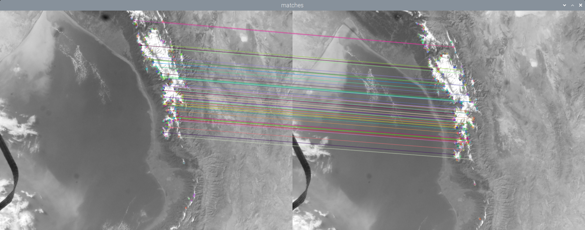

## Introduction

In this project, you will use photos taken by an Astro Pi Flight Unit on the ISS, to estimate the speed at which the ISS orbits the Earth.

A **The European Astro Pi Challenge** offers young people the amazing opportunity to conduct scientific investigations in space by writing computer programs that run on Raspberry Pi computers aboard the International Space Station (ISS).    

You will:

+ Extract EXIF data from images
+ Use OpenCV to calculate distances between similar features in two images
+ Calculate the speed of the ISS

--- task ---
  
The image below shows two photos taken from the ISS, with lines that connect similar features. By measuring the pixel distance between the features that have moved, you can calculate the speed that the camera was moving, and so work out how fast the ISS is travelling.

--- /task ---

To complete this project you will need:

**Hardware**

+ A computer that can run Python or a web-browser and access to [repl.it](https://replit.com)
 

**Software**

+ Thonny – this project can be completed using the Thonny Python editor, which can be installed on a Linux, Windows, or Mac computer

[[[thonny-install]]]

[[[change-theme-thonny]]]
