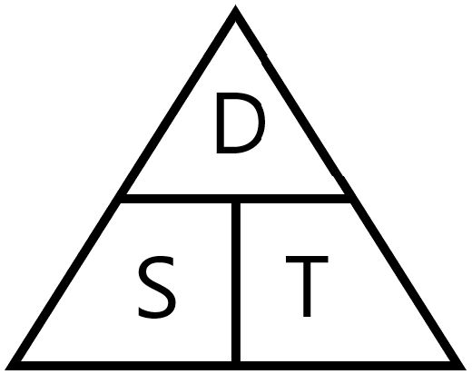

## Finding the time difference for two photos

You can calculate the speed an object is traveling at by dividing the distance it moves by the time it takes to move.



So, to calculate the speed of the ISS from photos, you need to know how much time has passed between when the photos were taken.

--- task ---

Remove the call to `print` the results of your `get_time` function.

--- code ---
---
language: python
filename: calc_speed.py
line_numbers: true
line_number_start: 
line_highlights: 13
---
from exif import Image
from datetime import datetime


def get_time(image):
    with open(image, 'rb') as image_file:
        img = Image(image_file)
        time_str = img.get("datetime_original")
        time = datetime.strptime(time_str, '%Y:%m:%d %H:%M:%S')
    return time


--- /code ---

--- /task ---


--- task ---

Create a new function called `get_time_difference`. It will take two arguments, which will be the file names of the two images.

--- code ---
---
language: python
filename: calc_speed.py
line_numbers: true
line_number_start: 13
line_highlights: 13
---
def get_time_difference(image_1, image_2):
--- /code ---

--- /task ---

--- task ---

Use your `get_time` function to get the times from the Exif data from each of the two images.

--- code ---
---
language: python
filename: calc_speed.py
line_numbers: true
line_number_start: 13
line_highlights: 14-15
---
def get_time_difference(image_1, image_2):
    time_1 = get_time(image_1)
    time_2 = get_time(image_2)
--- /code ---

--- /task ---

--- task ---

Subtract the two times from each other, and test it by printing.

--- code ---
---
language: python
filename: calc_speed.py
line_numbers: true
line_number_start: 13
line_highlights: 16-17
---
def get_time_difference(image_1, image_2):
    time_1 = get_time(image_1)
    time_2 = get_time(image_2)
    time_difference = time_2 - time_1
    print(time_difference)
--- /code ---

--- /task ---

--- task ---

You can run your function by calling it with two different image names.

--- code ---
---
language: python
filename: calc_speed.py
line_numbers: true
line_number_start: 13
line_highlights: 16-17
---
def get_time_difference(image_1, image_2):
    time_1 = get_time(image_1)
    time_2 = get_time(image_2)
    time_difference = time_2 - time_1
    print(time_difference)


get_time_difference('photo_1754.jpg', 'photo_1755.jpg')

--- /code ---

--- /task ---

--- task ---

Run your code, and if you have used the two images shown above, you should see output like this:

```
>>> 0:00:06
```

--- /task ---

--- task ---

The function needs to return the time in seconds, as an integer. The `datetime` package provides an easy conversion for this.

--- code ---
---
language: python
filename: calc_speed.py
line_numbers: true
line_number_start: 13
line_highlights: 17
---
def get_time_difference(image_1, image_2):
    time_1 = get_time(image_1)
    time_2 = get_time(image_2)
    time_difference = time_2 - time_1
    return time_difference.seconds

--- /code ---

--- /task ---

--- task ---

To test your code, you can `print` the output of the new function.

--- code ---
---
language: python
filename: calc_speed.py
line_numbers: true
line_number_start: 13
line_highlights: 17
---
def get_time_difference(image_1, image_2):
    time_1 = get_time(image_1)
    time_2 = get_time(image_2)
    time_difference = time_2 - time_1
    return time_difference.seconds


print(get_time_difference('photo_1754.jpg', 'photo_1755.jpg'))
--- /code ---

Your output should look something like this, depending on the photos you have chosen.

```
>>> 6
```
--- /task ---

--- save ---
